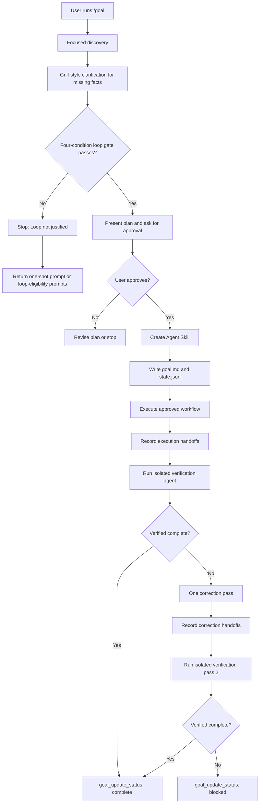

# opencode-goalkit

OpenCode plugin that adds approval-gated goal execution tools plus `/goal` and `/grill` commands.

## What It Does

- `/goal` turns a reusable, verifiable workflow into an approved execution loop with persistent goal state, handoffs, and isolated verification.
- `/grill` pressure-tests a task or plan before implementation by asking bounded, one-at-a-time design questions.

## Getting Started

Add the plugin to your OpenCode configuration, usually at `~/.config/opencode/opencode.json`:

```jsonc
{
  "$schema": "https://opencode.ai/config.json",
  "plugin": ["opencode-goalkit"]
}
```

Install the slash commands globally:

```sh
npx opencode-goalkit install --global
```

Restart OpenCode. Run one of these inside OpenCode:

```text
/goal implement the checkout retry workflow
/grill add GitHub issue sync to this plugin
```

The global command installer writes:

- `<global-opencode-config>/commands/goal.md`
- `<global-opencode-config>/commands/grill.md`

The global command installer does not copy plugin runtime files. OpenCode loads the plugin runtime from the npm package listed in your `opencode.json`.

## Install Options

Use global install when your OpenCode config loads `opencode-goalkit` from npm and you want the commands available everywhere:

```sh
npx opencode-goalkit install --global
```

Use project-local install when developing this plugin or when a project should carry its own copied command and plugin runtime files:

```sh
npx opencode-goalkit install --target /path/to/project
```

For local development from this repo:

```sh
node ./src/cli.js install --target /path/to/project
```

This writes:

- `.opencode/commands/goal.md`
- `.opencode/commands/grill.md`
- `.opencode/plugins/goalkit.js`
- `.opencode/plugins/goalkit/*.js`
- `.opencode/package.json`

Re-run with `--force` when upgrading copied project-local command or runtime files.

## Commands

Use `/goal` when the work is worth a reusable loop:

```text
/goal implement the checkout retry workflow
```

Use `/grill` when the plan is still fuzzy and you want the agent to clarify it before anyone builds:

```text
/grill add GitHub issue sync to this plugin
```

`/grill` explores the project first, asks exactly one meaningful question at a time, stops after shared understanding or 7 questions, and finishes with:

- shared understanding
- locked assumptions
- open risks
- recommended next step

## Goal Lifecycle

`/goal` starts with the same kind of bounded clarification as `/grill`, then runs a four-condition loop gate. The gate requires evidence for `repeats`, `automated_verification`, `bounded_execution`, and `senior_tools`.



If any gate condition lacks evidence, `/goal` stops before creating files or executing. It returns `Loop not justified`, the blocked condition, a one-shot alternative, and prompts for making the workflow loop-eligible.

After approval, `/goal` creates:

- `.agents/skills/<goal-id>/SKILL.md`
- `.opencode/goals/<goal-id>/goal.md`
- `.opencode/goals/<goal-id>/state.json`
- `.opencode/goals/<goal-id>/handoffs/*.md`

The `.agents/skills` file is the canonical reusable skill. The `state.json` file is the plugin runtime source of truth for active, complete, and blocked status.

The plugin exposes these lifecycle tools:

- `goal_get_status`
- `goal_list_goals`
- `goal_update_status`
- `goal_record_handoff`
- `goal_list_handoffs`

New handoffs write `#achieved`; legacy handoffs containing the old `#acheieved` heading are still accepted when read.

## Goal Example

Inside OpenCode:

```text
/goal implement the checkout retry workflow
```

The command first runs discovery and clarification. If the gate passes, it presents a concise plan and asks:

```text
Approve this plan? Reply approve to create the reusable goal skill and execute it.
```

After approval, it executes, records handoffs, verifies from handoff evidence only, then marks the goal `complete` or `blocked` with `goal_update_status`.

## Grill Example

Inside OpenCode:

```text
/grill add GitHub issue sync to this plugin
```

`/grill` is useful before implementation when scope, API shape, failure behavior, rollout, or acceptance criteria are still unclear. It does not edit files. It explores what it can infer from the repo, asks only questions that change the plan, and ends with enough shared understanding for a follow-up implementation prompt.
